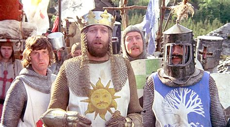
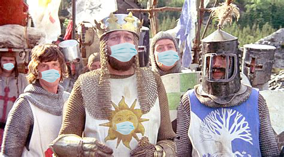

# ministry-of-truth

> "how do you expect to influence the future when you can't even change the past?"\
— Me

This project is the solution. It formats images and puts nice little face masks on each face.

In simple words\
**before:**\


**after:**\


## installation 

before changing the past you'll first need to install some packages with the following command:
```
pip install moviepy pillow face-recognition
```

## usage
You can choose to mask/unmask people in either video(`mp4`) or image(`png`,`jpg`)

To mask simply run:
```
./mask_on.py file
```

To unmask also simply run:
```
./fuck_it_mask_off.sh file
```

## TODO

- space out the images so everyone is 6ft apart.
